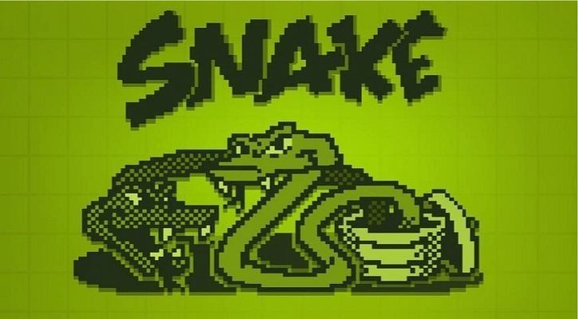

# 🐍 Snake Game 🐍

This is a classic Snake Game implemented in Python. In this game, you control a snake moving in a 2D map. Avoid the walls and eat apples to grow longer.



## Table of Contents

- [🚀 Features](#---features)
- [🛠️ Installation](#----installation)
  - [Prerequisites](#prerequisites)
  - [Installing `curses`](#installing--curses-)
- [🎮 Usage](#---usage)
- [🙏 Acknowledgments](#--acknowledgments)

## 📋 Requirements

[![python][python]][python-url]

## 🚀 Features

- 🎮 Classic snake game mechanics
- 🖥️ Simple 2D graphics
- ⌨️ Keyboard controls for snake movement
- 📈 Increasing difficulty as the snake grows

## 🛠️ Installation

### Prerequisites

You need to have Python installed on your system. Additionally, the game requires the `curses` library, which may need to be installed separately depending on your operating system.

### Installing `curses`

For **Windows**, you can install the `windows-curses` package using pip:

```bash
pip install windows-curses
```

For **Linux and MacOS**, the curses library is usually included with Python. If not, you can install it using your package manager. For example, on Ubuntu:

```bash
sudo apt-get install python3-curses
```

Cloning the Repository
Clone the project repository from GitHub:

```bash
git clone https://github.com/NhatDinh2411/SnakeGame.git
cd snake-game
```

Run the game using Python:

```bash
python play.py
```

## 🎮 Usage

**Controls**

- ⬅️ Arrow Left: Move left.

- ➡️ Arrow Right: Move right.

- ⬆️ Arrow Up: Move up.

- ⬇️ Arrow Down: Move down.

## 🙏 Acknowledgments

This game is inspired by the classic Snake game.
Thanks to the Python community for providing excellent resources and libraries.

[python]: https://img.shields.io/badge/python-3670A0?style=for-the-badge&logo=python&logoColor=ffdd54
[python-url]: https://www.python.org/
